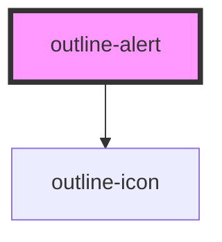

# outline-alert

<!-- Auto Generated Below -->

## Properties

| Property | Attribute | Description                                                   | Type                                                 | Default     |
| -------- | --------- | ------------------------------------------------------------- | ---------------------------------------------------- | ----------- |
| `icon`   | `icon`    | Choose which predefined icon to add to the link               | `IconTypeCustom \| IconTypeSolid \| IconTypeOutline` | `undefined` |
| `type`   | `type`    | The alert style to apply: info \| success \| warning \| error | `"error" \| "info" \| "success" \| "warning"`        | `'info'`    |

## Slots

| Slot        | Description                                   |
| ----------- | --------------------------------------------- |
| `"content"` | The primary slot to render the alert content. |

## Dependencies

### Depends on

- [outline-icon](../outline-icon)

### Graph

----------------------------------------------

*Built with [StencilJS](https://stenciljs.com/)*
