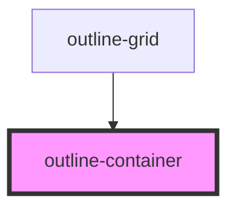

# outline-container

Contain content to the design system widths at the next breakpoint up.

- xs+: 100%
- sm+: 640px
- md+: 768px
- lg+: 1024px
- xl+: 1280px

<!-- Auto Generated Below -->

## Properties

| Property    | Attribute    | Description                                                                | Type                            | Default    |
| ----------- | ------------ | -------------------------------------------------------------------------- | ------------------------------- | ---------- |
| `align`     | `align`      | The horizontal placement of the container..                                | `"center" \| "left" \| "right"` | `'center'` |
| `fullBleed` | `full-bleed` | Whether or not this is a nested container. If it's nested, remove padding. | `boolean`                       | `false`    |
| `isNested`  | `is-nested`  | Whether or not this is a nested container. If it's nested, remove padding. | `boolean`                       | `false`    |

## Slots

| Slot            | Description |
| --------------- | ----------- |
| `"defaultSlot"` |             |

## Dependencies

### Used by

 - [outline-grid](../outline-grid)

### Graph

----------------------------------------------

*Built with [StencilJS](https://stenciljs.com/)*
