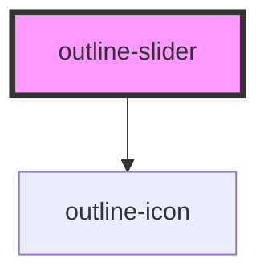

# outline-slider

<!-- Auto Generated Below -->

## Properties

| Property          | Attribute           | Description                                                                 | Type      | Default |
| ----------------- | ------------------- | --------------------------------------------------------------------------- | --------- | ------- |
| `autoplay`        | `autoplay`          | Whether to automatically advance slides                                     | `boolean` | `false` |
| `displayArrows`   | `display-arrows`    | Whether to display navigation arrows to switch slides                       | `boolean` | `true`  |
| `displayDots`     | `display-dots`      | Whether to display navigation dots to switch slides                         | `boolean` | `true`  |
| `duration`        | `duration`          | Delay between slides change (miliseconds, requires active autoplay)         | `number`  | `5000`  |
| `initialized`     | `initialized`       | Whether the slider has been initialized                                     | `boolean` | `false` |
| `loop`            | `loop`              | Whether to infinitely loop slides                                           | `boolean` | `false` |
| `slidesToDisplay` | `slides-to-display` | Number of slides to display (e.g. use 1.5 to display one and a half slides) | `number`  | `1`     |
| `spacing`         | `spacing`           | Spacing between slides                                                      | `number`  | `32`    |

## Slots

| Slot       | Description                            |
| ---------- | -------------------------------------- |
| `"slides"` | The slot containing the slide elements |

## Dependencies

### Depends on

- [outline-icon](../outline-icon)

### Graph

----------------------------------------------

*Built with [StencilJS](https://stenciljs.com/)*
