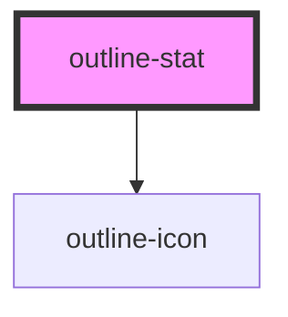

# outline-stat

<!-- Auto Generated Below -->

## Properties

| Property   | Attribute  | Description                                                                                                               | Type                                                 | Default     |
| ---------- | ---------- | ------------------------------------------------------------------------------------------------------------------------- | ---------------------------------------------------- | ----------- |
| `disabled` | `disabled` | Whether the stat is disabled. Only applies to implementations not using the url prop                                      | `boolean`                                            | `undefined` |
| `icon`     | `icon`     | Choose which predefined icon to add to the link                                                                           | `IconTypeCustom \| IconTypeSolid \| IconTypeOutline` | `undefined` |
| `target`   | `target`   | The target to use for a link, used in conjunction with the url attribute.                                                 | `"_blank" \| "_parent" \| "_self" \| "_top"`         | `'_self'`   |
| `url`      | `url`      | The url to use for a link. This will render an anchor element. Do not set this prop if you want to render a stat element. | `string`                                             | `undefined` |
| `variant`  | `variant`  | The stat style variant to use.                                                                                            | `"none" \| "primary" \| "secondary" \| "tertiary"`   | `'primary'` |

## Dependencies

### Depends on

- [outline-icon](../outline-icon)

### Graph

----------------------------------------------

*Built with [StencilJS](https://stenciljs.com/)*
